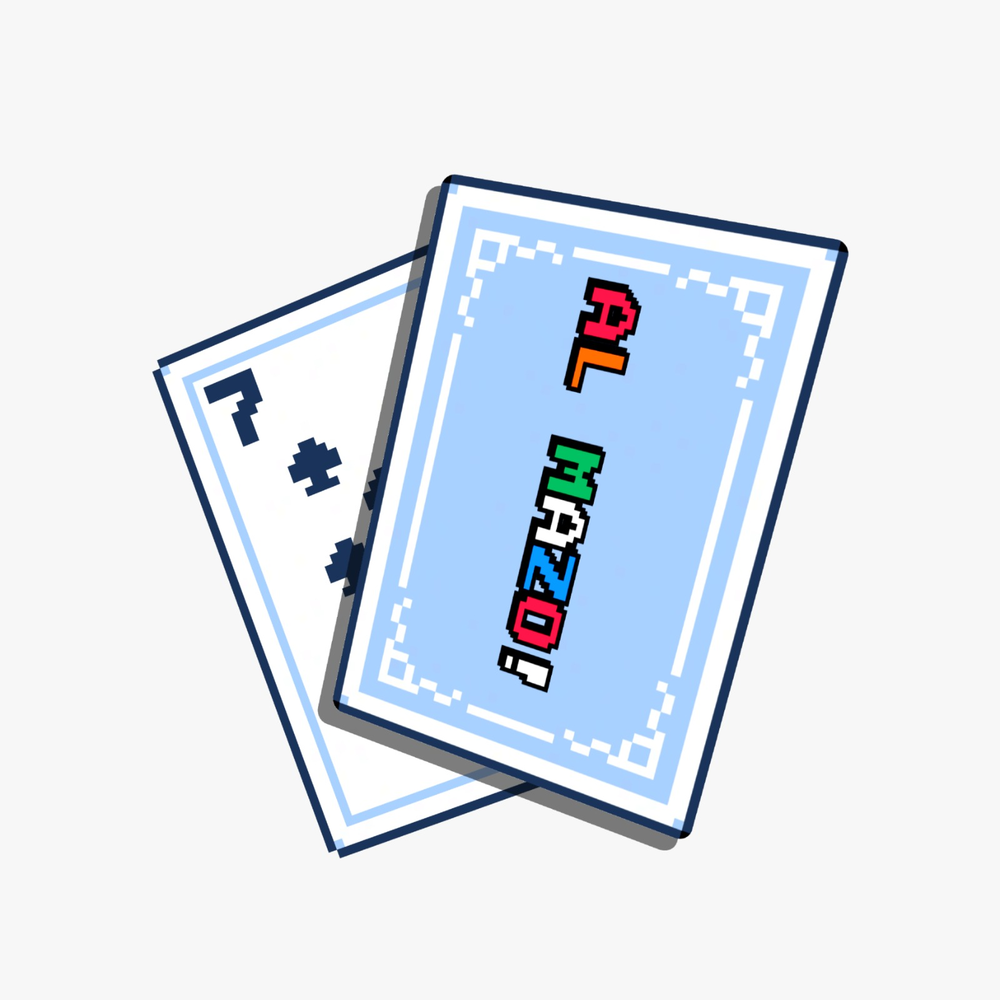

# Al Mazo



Modular platform for board and card games, local and online. Games are not hardcoded: each one is a JSON schema executed by a declarative rules engine, so new games and mechanics can be added without touching the engine.

**[Play now](https://al-mazo.webflow.io)** · **[Visual editor](https://al-mazo.webflow.io/editor)**

## Games

- **ColorMatch** — 108-card discard game with Classic, Blitz and Chaos modes.
- **Truco Argentino** — Trick-taking with envido, flor and the official card hierarchy.
- **Escoba del 15** — Capture table cards that add up to 15, with escobas and scoring.
- **Chinchón** — Spanish-deck rummy with melds and a target score.
- **Descarte Criollo** — 40-card Spanish-deck discard game with suit powers.
- **Desconectados** — Conversation game without a winner, online and pass-and-play.
- **HDP (Hasta Donde Puedas)** — Hidden-answer party game with a rotating judge.
- **Town of Salem** — Social deduction with hidden roles, night actions and day voting.

## How it works

- **Declarative engine.** A game is a `GameSchemaDefinition`: deck, rules, effects, win conditions, phases and zones. New mechanics are reusable capabilities, not `if (gameSlug === ...)` branches.
- **Authoritative server.** Public state (discard pile, active color, turn, card counts) is broadcast to the room; each player's hand is sent only to that player's socket.
- **Resilience.** Reconnect tokens plus a configurable grace window, and a room-level policy for players who do not come back.
- **Local mode.** The client can run a full match offline and sync the result later through `POST /api/matches/sync`.

## Run locally

Requirements: Node.js 20+, pnpm 10+, Docker.

```bash
pnpm install
docker compose up -d
cp .env.example .env
pnpm --filter al-mazo-server prisma:generate
pnpm dev
```

- Client: http://localhost:3001
- API and WebSocket: http://localhost:3000

## Tests

```bash
pnpm test
```

Vitest suite covering the rules engine, the official games, rooms and the REST API.

## Documentation

Architecture, REST API and Socket.io events: [docs/ARCHITECTURE.md](docs/ARCHITECTURE.md).

## Status

Al Mazo is a work in progress: everything described here is playable today, and new games, mechanics and editor capabilities are added continuously. The visual editor is in beta, so schemas and capabilities may still change.

## License

GPL-3.0. See [LICENSE](LICENSE).
